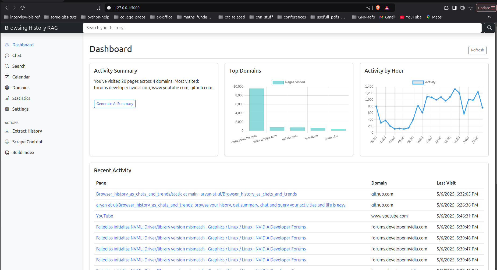
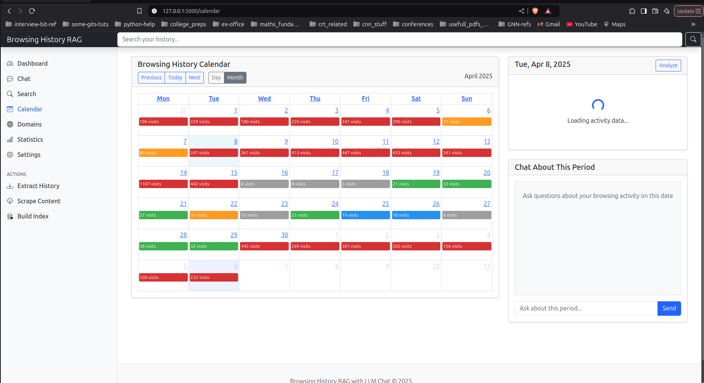
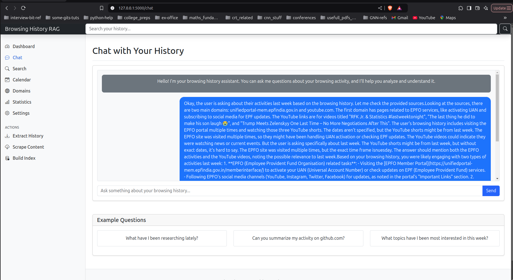
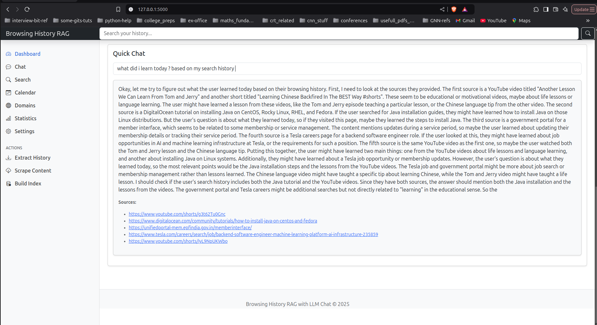

# Browsing History Analytics

A research-oriented tool for analyzing and interacting with your web browsing history using vector embeddings and large language models.



## Overview

This application provides researchers with tools to analyze web browsing patterns, extract insights, and interact with browsing history in natural language. It uses semantic vector search and language models to create a powerful research platform for understanding digital behavior.

The system extracts data from browser history databases, processes content from visited websites, and builds a searchable index that enables both structured queries and natural language interaction.

## Features

- **Browsing History Analysis**: Extract, process, and analyze your browser history
- **Semantic Search**: Find related content across your browsing history using vector similarity
- **Interactive Chat**: Ask questions about your browsing history in natural language
- **Calendar View**: Visualize your browsing activity over time with detailed period analysis
- **Domain Analysis**: See patterns in your visits to specific domains
- **Statistics Dashboard**: View comprehensive statistics about your browsing activity

## Research Applications

It helps if you are foregetful and need to recall somethings you need to look up, date wise, you can also chat and get summary of what you did (a lot more improvement needed, but it gets the job done)



This tool is designed for researchers in various fields:

<!-- - **Digital Behavior Analysis**: Study patterns in information seeking and consumption -->
- **Personal Knowledge Management**: Analyze how information is collected and revisited
<!-- - **Human-Computer Interaction**: Understand browsing habits and attention patterns -->
- **Privacy Research**: Explore the types of data available in browsing histories
- **Productivity Analysis**: Identify time spent on different digital activities

## Installation

### Prerequisites

- Python 3.10+
- Chrome/Firefox/Safari browser

### Setup

1. Clone the repository:
   ```
   git clone https://github.com/aryan-at-ul/Browser_history_as_chats_and_trends
   cd Browser_history_as_chats_and_trends
   ```

2. Create a virtual environment:
   ```
   python -m venv venv
   source venv/bin/activate  # On Windows: venv\Scripts\activate
   ```

3. Install dependencies:
   ```
   pip install -r requirements.txt
   ```

4. Configure settings in `src/config.py` for your environment

5. Run the extraction and processing pipeline:
   ```
   python serve.py --full-pipeline
   ```

## Usage

Start the application:
```
python serve.py
```

Then navigate to `http://localhost:5000` in your browser.

### Extracting History

To extract history from your browser, click the "Extract History" button in the sidebar or run:
```
python serve.py --extract
```

### Processing Content

Process and index content from your history:
```
python serve.py --process --index
```

### Using the Application

1. **Dashboard**: View summary statistics about your browsing activity
2. **Chat**: Ask questions about your browsing history
3. **Search**: Find specific content in your history
4. **Calendar**: Visualize activity patterns and analyze time periods
5. **Domains**: Explore activity by website
6. **Statistics**: View detailed browsing metrics

The chats are processed through Qwen 4b model, you can query on the entire database or on dashboard it can summarize based on top activities.





<!-- ## Architecture -->

<!--  -->

The application consists of several components:

- **History Extractor**: Extracts browsing history from browser databases
- **Content Processor**: Processes and chunks website content
- **Embedder**: Generates vector embeddings for content chunks
- **Index Builder**: Creates a searchable FAISS index
- **Retriever**: Handles search queries using vector similarity
- **Context Builder**: Assembles relevant context for LLM prompts
- **LLM Integration**: Generates responses based on retrieved content

## Development Roadmap

### Current To-Do List

- [ ] **User Preferences System**: Add personalized work and entertainment categories
- [ ] **Content Recommendation Engine**: Recommend content based on user preferences
- [ ] **Code Quality Improvements**: Implement Pylint, Poetry, Black
- [ ] **Documentation Enhancements**: Expand API documentation
- [ ] **Testing Suite**: Add comprehensive unit and integration tests
- [ ] **Performance Optimizations**: Optimize database and vector search operations 
- [ ] **Advanced Visualization**: Add more interactive data visualizations
- [ ] **Export Functionality**: Add ability to export analyses and reports

<!-- ### Future Research Directions

- Temporal pattern analysis in information seeking behavior
- Cross-domain knowledge graph construction
- Attention and focus metrics for productivity research
- Longitudinal behavioral analytics -->

## Contributing

Contributions are welcome! Please feel free to submit a Pull Request.

1. Fork the repository
2. Create your feature branch (`git checkout -b feature/amazing-feature`)
3. Commit your changes (`git commit -m 'Add some amazing feature'`)
4. Push to the branch (`git push origin feature/amazing-feature`)
5. Open a Pull Request

## License

This project is licensed under the MIT License - see the [LICENSE](LICENSE) file for details.

## Acknowledgments

- This project uses [FAISS](https://github.com/facebookresearch/faiss) for efficient similarity search
- Vector embeddings are generated using [Sentence Transformers](https://www.sbert.net/)
- LLM-powered chat features use various language models

---

*Note: This tool is designed for research purposes and personal use. It run on local, NO API CALL (GPU needed!!).*